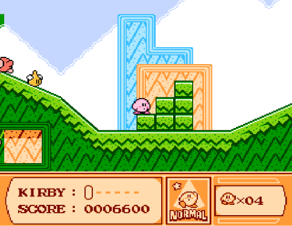

<!-- GENERAL GAME INFO -->
 

  <h2 align="center">Kirby's Adventure</h2>

  

    Kirby's Adventure is a platformer where you control Kirby as he navigates through different worlds, inhaling enemies to gain their abilities. Your objective is to defeat King Dedede and restore peace to Dream Land..
     
    <strong>Original game : </strong>
    <a href="https://en.wikipedia.org/wiki/Kirby%27s_Adventure"><strong>General info »</strong></a>
    ·
    <a href="https://www.youtube.com/watch?v=3jt__MP4IzE"><strong>Youtube video »<strong></a>
     
     
  

<!-- TABLE OF CONTENTS -->

  
Table of Contents

  <ol>
    <li>
      <a href="#about-the-project">About The Project</a>
    </li>
    <li>
      <a href="#my-version">My version</a>
    </li>
    <li>
      <a href="#getting-started">Getting Started</a>
    </li>
    <li><a href="#how-to-play">How To Play</a></li>
    <li><a href="#class-structure">Class structure</a></li>
    <li><a href="#checklist">Checklist</a></li>
    <li><a href="#contact">Contact</a></li>
    <li><a href="#acknowledgments">Acknowledgments</a></li>
  </ol>

<!-- ABOUT THE PROJECT -->
## About The Project

TODO: add screenshot 

Here's why:
TODO: describe why you chose this game 
    * I love Kirby :D
    * It seemed like the game would be challenging to make.

(<a href="#readme-top">back to top</a>)

## My version

This section gives a clear and detailed overview of which parts of the original game I planned to make.

### The minimum I will most certainly develop:
* Kirby's basic controls
* A power system that can easily accomodate new powers
* A level/scene system that can easily be adjusted and allow for easy level addition
* 

### What I will probably make as well:
* 2 levels to make sure that the transitions between scenes work
* An end screen and game over screen accurate to the game.

### What I plan to create if I have enough time left:
* Particle System
* More advanced controls such as Running and Controls
* Hub World
* Final part of Vegetable which includes

(<a href="#readme-top">back to top</a>)

<!-- GETTING STARTED -->
## Getting Started
Detailed instructions on how to run your game project are in this section.
- Set the game project as the start up project before launching.
  
### Prerequisites

This is an example of how to list things you need to use the software and how to install them.
* Visual Studio 2022

### How to run the project

Explain which project (version) must be run.
* any extra steps if required 

(<a href="#readme-top">back to top</a>)

<!-- HOW TO PLAY -->
## How to play

Use this space to show useful examples of how a game can be played. 
Additional screenshots and demos work well in this space. 
(WIP)

### Controls
* Arrow Keys - Movement
* Space - Jumping
* Z - Ability key
* UP Arrow key - Enter flying state

(<a href="#readme-top">back to top</a>)

<!-- CLASS STRUCTURE -->
## Class structure 

### Object composition 
If you applied object composition (optional); explain where and how.
A bit of object composition is used in this project. I believe I've used all the object composition techniques we were thought this semester a bit everywhere in thie project. A good few examples would be...

- AnimationController : *It <b>HAS</b> and owns a bunch of Animation objects. It is solely responsible to handle these objects.
- All my manager classes : A lot of, if not all of them, control and own the objects they are supposed to manage and are therefore responsible for their lifetime

### Inheritance 
Explain where you applied inheritance (mandatory).

- Component Class : A lot of classes enherit from this class. This class serves as a quick way to create objects with "Transform" objects and "CollisionBody" objects. Examples are...
    * Animation
    * AnimationController
    * Camera
    * EnemySpawner
    * Entity
    * World

- Entity Class : This class encapsulates anything that is supposed to be considered alive in the game (Kirby, enemies...) Therefore it makes sense for the following classes to enherit from it.
    * Player
    * Enemy
- Scene Class : This is a class that along with its manager is responsible to handle everything in the game. Each scene can then be smoothly transitioned into one another.
    * End Screen : This is a special type of scene that loads only when you complete the game !
    * Game Over : This is a scene that loads when you run out of lives. This scene will send you back to the start of the game after a few seconds.
- Power Class : This is the template used for every power in the game. Any entity in the game has the ability to use these powers. This makes it so enemies can use the powers they give to the player.
    * Beam Power
- Enemy Class : This class groups up all enemies in the game. This serves as a base for every enemy and allows some enemies to share some stuff. Currently the enemies in the game are..
    * Waddle Doo
    * Waddle Dee
    * Sparky
    * Hot Head
    * Bronto Burt

### ..

(<a href="#readme-top">back to top</a>)

<!-- CHECKLIST -->
## Checklist

- [x] Accept / set up github project
- [x] week 01 topics applied
    - [x] const keyword applied proactively (variables, functions,..)
    - [x] static keyword applied proactively (class variables, static functions,..)
    - [x] object composition (optional)
- [x] week 02 topics applied
- [x] week 03 topics applied
- [x] week 04 topics applied
- [x] week 05 topics applied
- [x] week 06 topics applied
- [x] week 07 topics applied
- [x] week 08 topics applied
- [ ] week 09 topics applied (optional)
- [ ] week 10 topics applied (optional)

(<a href="#readme-top">back to top</a>)

<!-- CONTACT -->
## Contact

Your Name - rity.simba-wina.kipula.tati@student.howest.be

Project Link: [https://github.com/HowestDAE/dae15-Shaeryry](https://github.com/HowestDAE/dae15-Shaeryry)

(<a href="#readme-top">back to top</a>)

<!-- ACKNOWLEDGMENTS -->
## Acknowledgments

Use this space to list resources you find helpful and would like to give credit to. 
* https://www.spriters-resource.com/nes/kirbyadv/
* https://www.dafont.com/kirbys-adventure.font
* https://www.sounds-resource.com/nes/kirbysadventure/sound/19653/
* [Example 1: cpp reference on std::vector](https://en.cppreference.com/w/cpp/container/vector)
* ..

(<a href="#readme-top">back to top</a>)

